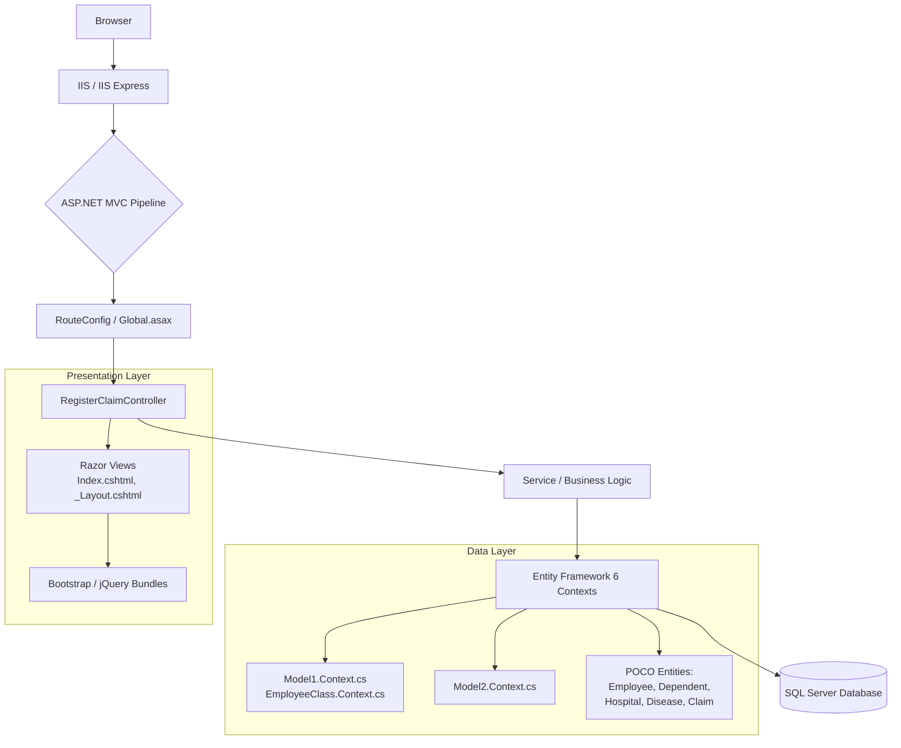

# RegisterClaim Management System

[]()
[]()
[]()
[]()
[]()

---

## 📖 Description

The **RegisterClaim Management System** is a robust, enterprise-grade **ASP.NET MVC 5** web application designed to streamline the registration, tracking, and management of claims—specifically tailored for healthcare or insurance domains involving **Employees**, **Dependents**, **Hospitals**, and **Diseases**.

Built on the **.NET Framework** utilizing **Entity Framework 6 (Model First / Database First)** via `.edmx` designers, the application follows a clean, layered architecture separating Data Access, Business Logic, and Presentation layers. It features a responsive, server-side rendered UI powered by **Bootstrap** and **jQuery**, with full support for client-side validation and unobtrusive AJAX patterns.

> **Note:** This is a legacy/maintenance-mode codebase (evident by jQuery 1.8.0 and ASP.NET MVC 5). It is ideal for organizations maintaining existing infrastructure or migrating to modern stacks (ASP.NET Core / Blazor / React).

---

## 🛠 Tech Stack

| Category | Technology / Library | Version / Details | Source Evidence |
| :--- | :--- | :--- | :--- |
| **Runtime** | .NET Framework | 4.7.2+ (Implied by MVC 5 / EF6) | `RegisterClaim.csproj`, `Web.config` |
| **Web Framework** | ASP.NET MVC | 5.2.x | `Controllers/`, `Views/`, `Global.asax`, `packages.config` |
| **ORM / Data Access** | Entity Framework | 6.x (Model First / DB First) | `*.edmx`, `*.tt`, `*.Context.cs`, `*.Designer.cs` |
| **Database** | SQL Server | (LocalDB / Express / Full) | `Web.config` Connection Strings |
| **View Engine** | Razor | V3 | `Views/*.cshtml`, `Views/web.config` |
| **Frontend CSS** | Bootstrap | 3.x / 4.x (Bundles & ESM present) | `Scripts/bootstrap*.js`, `Content/` (implied) |
| **Frontend JS** | jQuery | **1.8.0** (Legacy) | `Scripts/jquery-1.8.0.js` |
| **Validation** | jQuery Validation / Unobtrusive | Latest compatible with jQuery 1.8 | `Scripts/jquery.validate*.js` |
| **Date Picker** | Custom jQuery UI / Plugin | `jQueryDatePicker-1.js`, `jQueryDatePicker-2.js` | `Scripts/` |
| **Package Mgmt** | NuGet | `packages.config` (Legacy) | `packages.config` |
| **Build System** | MSBuild | `.csproj`, `.sln` (implied) | `RegisterClaim.csproj` |
| **Configuration** | XML Transforms | `Web.Debug.config`, `Web.Release.config` | Root directory |

---

## 🏗 Architecture Overview



### Key Architectural Decisions
1.  **Multi-Model EDMX Strategy**: Three distinct `.edmx` models (`EmployeeClass`, `Model1`, `Model2`) suggest **Bounded Contexts** or legacy database segregation (e.g., HR Data, Claims Data, Reference Data).
2.  **T4 Code Generation**: Heavy use of `.tt` templates (`Model1.tt`, `Model1.Context.tt`, etc.) for generating `DbContext` and Entity classes from the EDMX designers.
3.  **Legacy Client Stack**: jQuery 1.8.0 indicates the UI was architected ~2012-2014. Modernization requires careful handling of `jquery.validate.unobtrusive` compatibility.

---

## 📂 Project Structure

```text
RegisterClaim/
├── 📁 App_Start/                 # (Implied: RouteConfig, BundleConfig, FilterConfig)
├── 📁 Controllers/
│   └── RegisterClaimController.cs  # Primary MVC Controller
├── 📁 Models/
│   ├── RegisterClass1.cs           # ViewModel / DTO for Claim Registration
│   └── *.cs                        # Partial classes for EDMX entities (AllEmployee, Disease, Dependent, Hospital)
├── 📁 Views/
│   ├── 📁 RegisterClaim/
│   │   └── Index.cshtml            # Main Claim Registration View
│   ├── 📁 Shared/
│   │   ├── _Layout.cshtml          # Master Layout (Bootstrap Structure)
│   │   └── Error.cshtml            # (Implied)
│   ├── _ViewStart.cshtml           # Layout Injection
│   └── web.config                  # View Engine Config (Razor)
├── 📁 Scripts/                     # Client-side Assets (Committed)
│   ├── bootstrap*.js               # Bootstrap 3/4 Bundles, ESM, Minified
│   ├── jquery-1.8.0*.js            # **Legacy Core Library**
│   ├── jquery.validate*.js         # Validation Suite
│   └── jQueryDatePicker-*.js       # Custom Date Pickers
├── 📁 Properties/
│   └── AssemblyInfo.cs             # Assembly Metadata
├── 📁 Data Models (Root - EDMX Artifacts)
│   ├── EmployeeClass.edmx          # Context: Employees/Dependents
│   ├── Model1.edmx                 # Context: Core Domain
│   ├── Model2.edmx                 # Context: Claims/Transactions
│   ├── *.Context.cs / *.tt         # Generated Code & Templates
│   └── *.Designer.cs               # EF Metadata
├── Web.config                      # Main Config (ConnStrings, Auth, EF)
├── Web.Debug.config / Release.config # XDT Transforms
├── Global.asax / .cs               # Application Entry Point
├── RegisterClaim.csproj            # MSBuild Project File
├── packages.config                 # NuGet Packages Lockfile
└── README.md                       # This File
```

---

## ⚙️ Installation & Getting Started

### Prerequisites
*   **Visual Studio 2019/2022** (with **.NET Framework 4.7.2+** and **ASP.NET MVC 5** workloads installed).
*   **SQL Server** (LocalDB, Express, or Developer Edition).
*   **NuGet Package Restore** enabled (default in VS).

### Steps

1.  **Clone the Repository**
    ```bash
    git clone https://github.com/your-org/RegisterClaim.git
    cd RegisterClaim
    ```

2.  **Open Solution**
    Open `RegisterClaim.csproj` (or the containing `.sln` file) in Visual Studio.

3.  **Restore NuGet Packages**
    *   Right-click Solution -> **Restore NuGet Packages**.
    *   Or via CLI: `nuget restore RegisterClaim.csproj` (requires `nuget.exe`).

4.  **Database Setup (Critical)**
    The project uses **Entity Framework Model First / Database First** (`.edmx`).
    *   **Option A (Model First - Create DB from Model):**
        1.  Open `EmployeeClass.edmx`, `Model1.edmx`, `Model2.edmx` in Designer.
        2.  Right-click Designer Surface -> **Generate Database from Model**.
        3.  Run resulting `.sql` scripts against your SQL Instance.
    *   **Option B (Database First - Update Model from DB):**
        1.  Ensure target databases exist with correct schemas.
        2.  Right-click Designer Surface -> **Update Model from Database**.

5.  **Configure Connection Strings**
    Update `Web.config` (or `Web.Debug.config` for local dev) with your SQL Server connection strings.
    ```xml
    <!-- Web.config Example -->
    <connectionStrings>
      <add name="EmployeeClassEntities" 
           connectionString="metadata=res://*/EmployeeClass.csdl|res://*/EmployeeClass.ssdl|res://*/EmployeeClass.msl;provider=System.Data.SqlClient;provider connection string='data source=localhost;initial catalog=RegisterClaim_HR;integrated security=True;MultipleActiveResultSets=True;App=EntityFramework'" 
           providerName="System.Data.EntityClient" />
      <!-- Repeat for Model1Entities, Model2Entities -->
    </connectionStrings>
    ```

6.  **Build & Run**
    Press `F5` or `Ctrl+F5` to launch in IIS Express.

---

## ✨ Features

### 1. Claim Registration Workflow (`RegisterClaimController` / `Index.cshtml`)
*   **Employee Lookup**: Search/Select employees (`AllEmployee.cs`) and associated dependents (`Dependent.cs`).
*   **Dynamic Forms**: Cascading dropdowns for **Hospitals** (`Hospital.cs`) and **Diseases** (`Disease.cs` / `DiseaseClass1.cs`).
*   **Server/Client Validation**: Leverages `DataAnnotations` on `RegisterClass1.cs` ViewModel + `jquery.validate.unobtrusive`.

### 2. Multi-Context Data Architecture
*   **`EmployeeClass` Context**: HR Master Data (Employees, Dependents).
*   **`Model1` Context**: Core Reference Data (Hospitals, Diseases, Lookups).
*   **`Model2` Context**: Transactional Data (Claim Headers, Lines, Audit Trails).
*   *Benefit:* Clear separation of concerns, independent migration/deployment paths for bounded contexts.

### 3. Responsive Legacy UI
*   **Bootstrap Bundles**: Includes standard, minified, ESM, and bundle maps for debugging/production.
*   **Custom Date Pickers**: Two distinct jQuery DatePicker implementations (`jQueryDatePicker-1.js`, `jQueryDatePicker-2.js`) likely handling different browser compatibilities or UI requirements.

### 4. Configuration Management
*   **XDT Transforms**: `Web.Debug.config` / `Web.Release.config` for seamless CI/CD pipeline integration (connection strings, debug flags, compilation settings).

### 5. Extensible Metadata
*   **T4 Templates (`.tt`)**: Customizable code generation for Entities and `DbContext` classes (e.g., adding interfaces, `INotifyPropertyChanged`, or custom attributes).

---

## 🗄 Entity Framework & Data Model Details

### Contexts & Entities
| Context File | Primary Entities | Purpose |
| :--- | :--- | :--- |
| `EmployeeClass.Context.cs` | `Employee`, `Dependent`, `AllEmployee` | Human Resources / Payroll Integration |
| `Model1.Context.cs` | `Hospital`, `Disease`, `DiseaseClass1` | Reference / Master Data Management |
| `Model2.Context.cs` | `Claim`, `ClaimDetail`, `RegisterClaim` | Transactional Claim Processing |

### Extending the Model
1.  Modify the **`.edmx`** diagram (Designer or XML).
2.  Save -> T4 Templates (`.tt`) auto-regenerate `*.cs` / `*.Context.cs`.
3.  **Warning**: Do not edit `*.Designer.cs` or generated `*.cs` files directly; changes will be overwritten. Use **Partial Classes** (e.g., `EmployeeClass.cs`, `Hospital.cs` in root) for custom logic.

---

## 🌐 Client-Side Library Inventory (`Scripts/`)

| Library | Version | Files Present | Notes |
| :--- | :--- | :--- | :--- |
| **jQuery** | **1.8.0** | `jquery-1.8.0.js`, `.min.js`, `.intellisense.js`, `jQuery.js` | **Critical Legacy Dependency**. Upgrading breaks `validate.unobtrusive` v3+. |
| **Bootstrap** | 3.x / 4.x | `bootstrap.js`, `.bundle.js`, `.esm.js`, `.min.js`, `.map` | Multiple module formats included (UMD, ESM). |
| **jQuery Validation** | 1.11.x - 1.19.x | `jquery.validate.js`, `.min.js`, `.vsdoc.js` | Must match jQuery 1.8 compatibility. |
| **Unobtrusive Validation** | 3.x | `jquery.validate.unobtrusive.js`, `.min.js` | Bridges MVC `DataAnnotations` -> JS Rules. |
| **Custom Date Pickers** | Custom | `jQueryDatePicker-1.js`, `jQueryDatePicker-2.js` | Likely wraps jQuery UI Datepicker or custom plugin. |

> **Modernization Path**: Migrate to **ASP.NET Core** + **Razor Pages/Blazor** + **LibMan/npm** for client libs. Replace jQuery 1.8 with `fetch`/Axios + modern Validator.

---

## 🚀 Deployment

1.  **Publish Profile**: Create `FolderProfile` or `WebDeploy` profile in VS.
2.  **Configuration**: Ensure `Web.Release.config` transforms apply correctly:
    *   `debug="false"`
    *   Production Connection Strings.
    *   Remove `trace` listeners.
3.  **Database**: Run EF Migrations (if Code First enabled later) or deploy `.dacpac`/SQL scripts generated from EDMX.
4.  **IIS Setup**: App Pool -> **.NET CLR Version v4.0** (Integrated Pipeline).

---

## 🤝 Contributing

1.  Fork the repository.
2.  Create a feature branch (`git checkout -b feature/amazing-feature`).
3.  **Respect the Legacy Stack**: Do not upgrade jQuery/EF/MVC in a feature branch without a dedicated "Modernization Epic" branch.
4.  Commit changes (`git commit -m 'Add amazing feature'`).
5.  Push to branch (`git push origin feature/amazing-feature`).
6.  Open a Pull Request.

---

## 📄 License

Distributed under the **MIT License**. See `LICENSE` file for more information (create one if missing).

---

## 📞 Support & Contact

*   **Maintainer**: [Your Name/Team]
*   **Email**: support@example.com
*   **Wiki**: [Link to Internal Wiki/Confluence for Business Rules]

---

> **Generated** by Technical Writer Agent | Based on Repository File Manifest Analysis